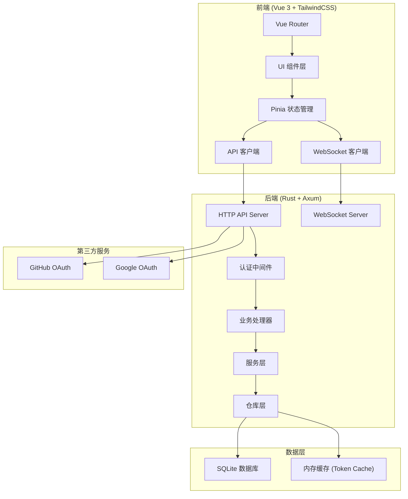

# Technical Design Document

Feature Name: community-forum
Updated: 2026-04-23

## Description

社区论坛系统是一个前后端分离的全栈 Web 应用，使用 Rust + Axum 构建高性能后端服务，Vue 3 + TailwindCSS 构建现代化前端界面。系统支持 WebSocket 实时通信、OAuth2 第三方登录（GitHub/Google）、完整的用户社交体系（关注、收藏、点赞）和管理员后台。

## Architecture

### System Architecture



### Project Structure

```
/workspace
├── backend/                    # Rust 后端项目
│   ├── src/
│   │   ├── main.rs            # 应用入口
│   │   ├── config.rs          # 配置管理
│   │   ├── error.rs           # 错误定义
│   │   ├── extractors.rs      # 请求提取器
│   │   ├── middleware/        # 中间件
│   │   │   ├── auth.rs        # JWT 认证中间件
│   │   │   └── cors.rs        # CORS 中间件
│   │   ├── routes/            # 路由定义
│   │   │   ├── mod.rs
│   │   │   ├── auth.rs        # 认证相关路由
│   │   │   ├── user.rs        # 用户相关路由
│   │   │   ├── post.rs        # 帖子相关路由
│   │   │   ├── comment.rs     # 评论相关路由
│   │   │   ├── notification.rs # 通知相关路由
│   │   │   ├── admin.rs       # 管理后台路由
│   │   │   └── ws.rs          # WebSocket 路由
│   │   ├── services/         # 业务逻辑层
│   │   │   ├── mod.rs
│   │   │   ├── auth_service.rs
│   │   │   ├── user_service.rs
│   │   │   ├── post_service.rs
│   │   │   ├── comment_service.rs
│   │   │   ├── vote_service.rs
│   │   │   ├── follow_service.rs
│   │   │   ├── notification_service.rs
│   │   │   └── admin_service.rs
│   │   ├── repositories/      # 数据访问层
│   │   │   ├── mod.rs
│   │   │   ├── user_repo.rs
│   │   │   ├── post_repo.rs
│   │   │   ├── comment_repo.rs
│   │   │   ├── vote_repo.rs
│   │   │   ├── follow_repo.rs
│   │   │   ├── notification_repo.rs
│   │   │   └── report_repo.rs
│   │   ├── models/            # 数据模型
│   │   │   ├── mod.rs
│   │   │   ├── user.rs
│   │   │   ├── post.rs
│   │   │   ├── comment.rs
│   │   │   ├── vote.rs
│   │   │   ├── follow.rs
│   │   │   ├── notification.rs
│   │   │   └── response.rs    # API 响应模型
│   │   ├── ws/                # WebSocket 处理
│   │   │   ├── mod.rs
│   │   │   ├── handler.rs
│   │   │   ├── client.rs
│   │   │   └── broadcast.rs
│   │   └── oauth/             # OAuth 第三方登录
│   │       ├── mod.rs
│   │       ├── github.rs
│   │       └── google.rs
│   ├── Cargo.toml
│   └── migrations/             # 数据库迁移
│       └── 001_initial.sql
│
├── frontend/                   # Vue 3 前端项目
│   ├── src/
│   │   ├── main.ts           # 应用入口
│   │   ├── App.vue           # 根组件
│   │   ├── router/
│   │   │   └── index.ts     # 路由配置
│   │   ├── stores/           # Pinia 状态管理
│   │   │   ├── auth.ts
│   │   │   ├── user.ts
│   │   │   ├── post.ts
│   │   │   ├── notification.ts
│   │   │   └── ws.ts
│   │   ├── composables/      # 组合式函数
│   │   │   ├── useApi.ts
│   │   │   ├── useWebSocket.ts
│   │   │   └── useToast.ts
│   │   ├── components/       # 公共组件
│   │   │   ├── layout/
│   │   │   │   ├── Navbar.vue
│   │   │   │   ├── Sidebar.vue
│   │   │   │   └── Footer.vue
│   │   │   ├── post/
│   │   │   │   ├── PostCard.vue
│   │   │   │   ├── PostList.vue
│   │   │   │   └── PostEditor.vue
│   │   │   ├── comment/
│   │   │   │   ├── CommentItem.vue
│   │   │   │   └── CommentList.vue
│   │   │   ├── user/
│   │   │   │   ├── UserAvatar.vue
│   │   │   │   └── UserCard.vue
│   │   │   └── common/
│   │   │       ├── Button.vue
│   │   │       ├── Input.vue
│   │   │       ├── Modal.vue
│   │   │       ├── Toast.vue
│   │   │       ├── Loading.vue
│   │   │       └── Empty.vue
│   │   ├── views/            # 页面视图
│   │   │   ├── Home.vue
│   │   │   ├── Login.vue
│   │   │   ├── Register.vue
│   │   │   ├── PostDetail.vue
│   │   │   ├── CreatePost.vue
│   │   │   ├── Profile.vue
│   │   │   ├── Settings.vue
│   │   │   ├── Notifications.vue
│   │   │   ├── Bookmarks.vue
│   │   │   ├── Tags.vue
│   │   │   ├── TagPosts.vue
│   │   │   ├── Followers.vue
│   │   │   ├── Following.vue
│   │   │   └── admin/
│   │   │       ├── Dashboard.vue
│   │   │       ├── UserManagement.vue
│   │   │       ├── ContentModeration.vue
│   │   │       └── ReportHandling.vue
│   │   ├── styles/
│   │   │   └── main.css      # Tailwind 入口
│   │   ├── types/            # TypeScript 类型
│   │   │   └── index.ts
│   │   └── utils/             # 工具函数
│   │       ├── markdown.ts
│   │       └── time.ts
│   ├── index.html
│   ├── package.json
│   ├── vite.config.ts
│   ├── tailwind.config.js
│   └── tsconfig.json
│
└── SPEC.md                    # 项目规格说明
```

## API Design

### Base URL

```
http://localhost:3000/api/v1
```

### Authentication

#### POST /auth/register - 用户注册
Request:
```json
{
  "email": "user@example.com",
  "password": "SecurePass123",
  "username": "johndoe"
}
```
Response (201):
```json
{
  "message": "Registration successful. Please check your email to verify.",
  "user_id": "uuid"
}
```

#### POST /auth/login - 用户登录
Request:
```json
{
  "email": "user@example.com",
  "password": "SecurePass123"
}
```
Response (200):
```json
{
  "access_token": "eyJhbGciOiJIUzI1NiIs...",
  "refresh_token": "eyJhbGciOiJIUzI1NiIs...",
  "user": {
    "id": "uuid",
    "username": "johndoe",
    "email": "user@example.com",
    "avatar_url": "https://...",
    "is_admin": false
  }
}
```

#### POST /auth/verify-email/{token} - 邮箱验证
Response (200):
```json
{
  "message": "Email verified successfully"
}
```

#### GET /auth/github - GitHub OAuth 登录入口
Response: Redirect to GitHub OAuth page

#### GET /auth/github/callback - GitHub OAuth 回调
Response: Redirect to frontend with tokens in URL hash

#### GET /auth/google - Google OAuth 登录入口
Response: Redirect to Google OAuth page

#### GET /auth/google/callback - Google OAuth 回调
Response: Redirect to frontend with tokens in URL hash

#### POST /auth/refresh - 刷新 Token
Request:
```json
{
  "refresh_token": "eyJhbGciOiJIUzI1NiIs..."
}
```
Response (200):
```json
{
  "access_token": "eyJhbGciOiJIUzI1NiIs...",
  "refresh_token": "eyJhbGciOiJIUzI1NiIs..."
}
```

### Users

#### GET /users/{username} - 获取用户公开资料
Response (200):
```json
{
  "id": "uuid",
  "username": "johndoe",
  "avatar_url": "https://...",
  "bio": "Software developer",
  "post_count": 42,
  "follower_count": 128,
  "following_count": 56,
  "is_following": true,
  "created_at": "2024-01-15T10:30:00Z"
}
```

#### PATCH /users/me - 更新个人资料
Request:
```json
{
  "username": "johndoe2",
  "bio": "Updated bio",
  "avatar_url": "https://..."
}
```
Response (200): Updated user object

#### GET /users/{username}/posts - 获取用户帖子列表
Query: `?page=1&limit=20`
Response (200):
```json
{
  "posts": [...],
  "total": 42,
  "page": 1,
  "limit": 20
}
```

### Posts

#### GET /posts - 获取帖子列表
Query: `?page=1&limit=20&tag=rust&sort=latest|popular`
Response (200):
```json
{
  "posts": [
    {
      "id": "uuid",
      "title": "Post Title",
      "content": "Post content excerpt...",
      "author": {
        "id": "uuid",
        "username": "johndoe",
        "avatar_url": "https://..."
      },
      "tags": ["rust", "programming"],
      "like_count": 15,
      "comment_count": 8,
      "is_bookmarked": true,
      "created_at": "2024-01-20T15:30:00Z"
    }
  ],
  "total": 100,
  "page": 1,
  "limit": 20
}
```

#### GET /posts/{id} - 获取帖子详情
Response (200):
```json
{
  "id": "uuid",
  "title": "Post Title",
  "content": "Full post content in Markdown...",
  "author": {...},
  "tags": ["rust", "programming"],
  "like_count": 15,
  "dislike_count": 2,
  "comment_count": 8,
  "is_bookmarked": false,
  "is_liked": true,
  "created_at": "2024-01-20T15:30:00Z",
  "updated_at": "2024-01-20T15:30:00Z"
}
```

#### POST /posts - 创建帖子
Request:
```json
{
  "title": "My New Post",
  "content": "Post content in Markdown...",
  "tags": ["discussion", "help"]
}
```
Response (201): Created post object

#### PATCH /posts/{id} - 更新帖子
Request:
```json
{
  "title": "Updated Title",
  "content": "Updated content...",
  "tags": ["updated"]
}
```
Response (200): Updated post object

#### DELETE /posts/{id} - 删除帖子
Response (204): No content

### Comments

#### GET /posts/{post_id}/comments - 获取评论列表
Query: `?page=1&limit=20`
Response (200):
```json
{
  "comments": [
    {
      "id": "uuid",
      "content": "Comment content",
      "author": {...},
      "parent_id": null,
      "reply_count": 3,
      "like_count": 5,
      "is_liked": false,
      "is_deleted": false,
      "created_at": "2024-01-21T10:00:00Z"
    }
  ],
  "total": 15,
  "page": 1,
  "limit": 20
}
```

#### POST /posts/{post_id}/comments - 添加评论
Request:
```json
{
  "content": "This is my comment",
  "parent_id": null
}
```
Response (201): Created comment object

#### PATCH /comments/{id} - 编辑评论
Request:
```json
{
  "content": "Updated comment content"
}
```
Response (200): Updated comment object

#### DELETE /comments/{id} - 删除评论
Response (204): No content

### Votes (点赞/踩)

#### POST /votes - 投票
Request:
```json
{
  "post_id": "uuid",
  "comment_id": null,
  "value": 1
}
```
Response (200):
```json
{
  "post_id": "uuid",
  "like_count": 16,
  "dislike_count": 2
}
```

#### DELETE /votes/{post_id} - 取消投票
Response (200): Updated counts

### Bookmarks (收藏)

#### GET /users/me/bookmarks - 获取收藏列表
Query: `?page=1&limit=20`
Response (200): Paginated posts

#### POST /bookmarks - 添加收藏
Request:
```json
{
  "post_id": "uuid"
}
```
Response (201):
```json
{
  "message": "Post bookmarked"
}
```

#### DELETE /bookmarks/{post_id} - 取消收藏
Response (204): No content

### Follow (关注)

#### POST /follow/{user_id} - 关注用户
Response (200):
```json
{
  "message": "User followed"
}
```

#### DELETE /follow/{user_id} - 取消关注
Response (204): No content

#### GET /users/{username}/followers - 获取粉丝列表
Query: `?page=1&limit=20`
Response (200): Paginated users

#### GET /users/{username}/following - 获取关注列表
Query: `?page=1&limit=20`
Response (200): Paginated users

### Tags (标签)

#### GET /tags - 获取标签列表
Query: `?page=1&limit=20&sort=popular|latest"`
Response (200):
```json
{
  "tags": [
    {
      "id": "uuid",
      "name": "rust",
      "post_count": 156
    }
  ],
  "total": 50,
  "page": 1,
  "limit": 20
}
```

#### GET /tags/{name} - 获取标签详情
Response (200): Tag object with post count

### Notifications (通知)

#### GET /notifications - 获取通知列表
Query: `?page=1&limit=20&unread_only=false`
Response (200):
```json
{
  "notifications": [
    {
      "id": "uuid",
      "type": "comment",
      "actor": {...},
      "post_id": "uuid",
      "comment_id": "uuid",
      "is_read": false,
      "created_at": "2024-01-22T08:00:00Z"
    }
  ],
  "unread_count": 5,
  "total": 20,
  "page": 1,
  "limit": 20
}
```

#### PATCH /notifications/{id}/read - 标记已读
Response (200): Updated notification

#### PATCH /notifications/read-all - 全部已读
Response (200):
```json
{
  "message": "All notifications marked as read"
}
```

### Admin (管理后台)

#### GET /admin/stats - 获取统计信息
Response (200):
```json
{
  "daily_active_users": 150,
  "total_posts": 1250,
  "total_comments": 8500,
  "total_users": 320,
  "posts_chart": [...],
  "users_chart": [...]
}
```

#### GET /admin/users - 获取用户列表
Query: `?page=1&limit=20&search=keyword&status=all|active|banned`
Response (200): Paginated users

#### PATCH /admin/users/{id}/status - 更新用户状态
Request:
```json
{
  "is_locked": true,
  "reason": "Spam behavior"
}
```
Response (200): Updated user

#### GET /admin/posts/pending - 获取待审核帖子
Query: `?page=1&limit=20`
Response (200): Paginated posts

#### PATCH /admin/posts/{id}/approve - 审核通过
Response (200): Updated post

#### DELETE /admin/posts/{id} - 删除帖子
Response (204): No content

#### GET /admin/reports - 获取举报列表
Query: `?page=1&limit=20&status=pending|processed|dismissed`
Response (200): Paginated reports

#### PATCH /admin/reports/{id} - 处理举报
Request:
```json
{
  "status": "processed",
  "action": "warn_user|ban_post|dismiss"
}
```
Response (200): Updated report

## WebSocket Protocol

### Connection

Connect to: `ws://localhost:3000/ws?token={access_token}`

### Message Format

```json
{
  "type": "notification|new_post|presence",
  "payload": {...},
  "timestamp": "2024-01-22T10:00:00Z"
}
```

### Message Types

#### notification - 通知推送
```json
{
  "type": "notification",
  "payload": {
    "id": "uuid",
    "notification_type": "comment",
    "actor": {
      "id": "uuid",
      "username": "johndoe",
      "avatar_url": "https://..."
    },
    "post_id": "uuid",
    "post_title": "Post Title"
  }
}
```

#### new_post - 新帖子动态
```json
{
  "type": "new_post",
  "payload": {
    "post": {...},
    "actor": {
      "id": "uuid",
      "username": "johndoe"
    }
  }
}
```

#### presence - 用户在线状态
```json
{
  "type": "presence",
  "payload": {
    "user_id": "uuid",
    "status": "online|offline"
  }
}
```

### Client Commands

#### subscribe_to_tag
```json
{
  "command": "subscribe_to_tag",
  "tag": "rust"
}
```

#### unsubscribe_from_tag
```json
{
  "command": "unsubscribe_from_tag",
  "tag": "rust"
}
```

## Database Schema

### Tables

```sql
-- Users table
CREATE TABLE users (
    id TEXT PRIMARY KEY,
    username TEXT UNIQUE NOT NULL,
    email TEXT UNIQUE NOT NULL,
    password_hash TEXT,
    avatar_url TEXT,
    bio TEXT,
    email_verified INTEGER DEFAULT 0,
    is_admin INTEGER DEFAULT 0,
    is_locked INTEGER DEFAULT 0,
    failed_login_attempts INTEGER DEFAULT 0,
    locked_until TEXT,
    created_at TEXT NOT NULL,
    updated_at TEXT NOT NULL
);

-- OAuth accounts
CREATE TABLE oauth_accounts (
    id TEXT PRIMARY KEY,
    user_id TEXT NOT NULL REFERENCES users(id),
    provider TEXT NOT NULL,
    provider_user_id TEXT NOT NULL,
    created_at TEXT NOT NULL,
    UNIQUE(provider, provider_user_id)
);

-- Tags
CREATE TABLE tags (
    id TEXT PRIMARY KEY,
    name TEXT UNIQUE NOT NULL,
    post_count INTEGER DEFAULT 0,
    created_at TEXT NOT NULL
);

-- Posts
CREATE TABLE posts (
    id TEXT PRIMARY KEY,
    author_id TEXT NOT NULL REFERENCES users(id),
    title TEXT NOT NULL,
    content TEXT NOT NULL,
    is_deleted INTEGER DEFAULT 0,
    created_at TEXT NOT NULL,
    updated_at TEXT NOT NULL
);

-- Post-Tag relationship
CREATE TABLE post_tags (
    post_id TEXT NOT NULL REFERENCES posts(id),
    tag_id TEXT NOT NULL REFERENCES tags(id),
    PRIMARY KEY (post_id, tag_id)
);

-- Comments
CREATE TABLE comments (
    id TEXT PRIMARY KEY,
    post_id TEXT NOT NULL REFERENCES posts(id),
    author_id TEXT NOT NULL REFERENCES users(id),
    parent_id TEXT REFERENCES comments(id),
    content TEXT NOT NULL,
    is_deleted INTEGER DEFAULT 0,
    created_at TEXT NOT NULL,
    updated_at TEXT NOT NULL
);

-- Votes
CREATE TABLE votes (
    id TEXT PRIMARY KEY,
    user_id TEXT NOT NULL REFERENCES users(id),
    post_id TEXT REFERENCES posts(id),
    comment_id TEXT REFERENCES comments(id),
    value INTEGER NOT NULL,
    created_at TEXT NOT NULL,
    UNIQUE(user_id, post_id),
    UNIQUE(user_id, comment_id),
    CHECK (post_id IS NOT NULL OR comment_id IS NOT NULL)
);

-- Bookmarks
CREATE TABLE bookmarks (
    id TEXT PRIMARY KEY,
    user_id TEXT NOT NULL REFERENCES users(id),
    post_id TEXT NOT NULL REFERENCES posts(id),
    created_at TEXT NOT NULL,
    UNIQUE(user_id, post_id)
);

-- Follows
CREATE TABLE follows (
    id TEXT PRIMARY KEY,
    follower_id TEXT NOT NULL REFERENCES users(id),
    following_id TEXT NOT NULL REFERENCES users(id),
    created_at TEXT NOT NULL,
    UNIQUE(follower_id, following_id)
);

-- Notifications
CREATE TABLE notifications (
    id TEXT PRIMARY KEY,
    user_id TEXT NOT NULL REFERENCES users(id),
    type TEXT NOT NULL,
    actor_id TEXT NOT NULL REFERENCES users(id),
    post_id TEXT REFERENCES posts(id),
    comment_id TEXT REFERENCES comments(id),
    is_read INTEGER DEFAULT 0,
    created_at TEXT NOT NULL
);

-- Reports
CREATE TABLE reports (
    id TEXT PRIMARY KEY,
    reporter_id TEXT NOT NULL REFERENCES users(id),
    post_id TEXT REFERENCES posts(id),
    comment_id TEXT REFERENCES comments(id),
    reason TEXT NOT NULL,
    status TEXT DEFAULT 'pending',
    created_at TEXT NOT NULL,
    processed_at TEXT,
    processed_by TEXT REFERENCES users(id)
);

-- Indexes
CREATE INDEX idx_posts_author ON posts(author_id);
CREATE INDEX idx_posts_created ON posts(created_at DESC);
CREATE INDEX idx_comments_post ON comments(post_id);
CREATE INDEX idx_comments_author ON comments(author_id);
CREATE INDEX idx_notifications_user ON notifications(user_id);
CREATE INDEX idx_notifications_created ON notifications(created_at DESC);
CREATE INDEX idx_follows_follower ON follows(follower_id);
CREATE INDEX idx_follows_following ON follows(following_id);
```

## Error Handling

### Error Response Format

```json
{
  "error": {
    "code": "VALIDATION_ERROR",
    "message": "Invalid input data",
    "details": [
      {
        "field": "email",
        "message": "Invalid email format"
      }
    ]
  }
}
```

### Error Codes

| Code | HTTP Status | Description |
|------|-------------|-------------|
| VALIDATION_ERROR | 400 | 请求参数验证失败 |
| UNAUTHORIZED | 401 | 未认证或 Token 无效 |
| FORBIDDEN | 403 | 无权限访问 |
| NOT_FOUND | 404 | 资源不存在 |
| CONFLICT | 409 | 资源冲突（如邮箱已注册） |
| RATE_LIMITED | 429 | 请求过于频繁 |
| INTERNAL_ERROR | 500 | 服务器内部错误 |

## Frontend UI/UX Design

### Color Palette

```css
:root {
  --color-primary: #3b82f6;      /* Blue 500 */
  --color-primary-hover: #2563eb; /* Blue 600 */
  --color-secondary: #64748b;    /* Slate 500 */
  --color-accent: #f59e0b;       /* Amber 500 */
  --color-success: #10b981;     /* Emerald 500 */
  --color-error: #ef4444;        /* Red 500 */
  --color-warning: #f59e0b;      /* Amber 500 */
  --color-background: #f8fafc;   /* Slate 50 */
  --color-surface: #ffffff;
  --color-text-primary: #1e293b; /* Slate 800 */
  --color-text-secondary: #64748b; /* Slate 500 */
  --color-border: #e2e8f0;       /* Slate 200 */
}
```

### Typography

- Headings: Inter, system-ui, sans-serif
- Body: Inter, system-ui, sans-serif
- Code: JetBrains Mono, monospace

### Layout

- Max content width: 1280px
- Main content: 800px
- Sidebar: 280px
- Card border-radius: 12px
- Button border-radius: 8px

### Animations

- Page transitions: fade + slide, 300ms ease-out
- Hover states: 150ms ease
- Loading skeletons: pulse animation
- Toast notifications: slide in from top-right
- Modal: fade + scale from 95%

## Security Considerations

1. **JWT Tokens**: Access token expires in 24h, refresh token in 7 days
2. **Password Hashing**: bcrypt with cost factor 12
3. **CORS**: Strict origin checking in production
4. **Rate Limiting**: 100 requests/minute per IP for unauthenticated, 1000 for authenticated
5. **Input Validation**: All inputs validated using validator crates
6. **XSS Prevention**: Output encoding on frontend, sanitization on backend
7. **SQL Injection**: Use of parameterized queries via sqlx

## Performance Considerations

1. **Database Indexes**: Created on frequently queried columns
2. **Connection Pooling**: sqlx built-in connection pool
3. **Caching**: In-memory token cache to reduce DB lookups
4. **Pagination**: All list endpoints support cursor-based pagination
5. **WebSocket**: Efficient broadcast usingtokio broadcast channel
6. **Static Files**: Served with compression (gzip/brotli)
